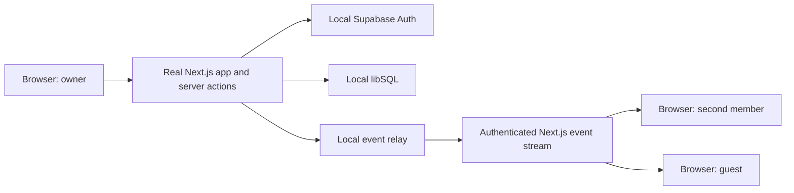

# Local E2E Environment Plan

## Implementation status — 2026-09-23

The local environment is implemented and verified in `feat/local-e2e-environment`. The separate hosted Ably check still needs a dedicated test key. The default `test:e2e:local` now uses a pinned Linux runner and an isolated Docker network with no host gateway. Supabase bootstrap occurs first on a temporary owned bridge because the host CLI requires published startup ports; runtime recreates only owned containers on the isolated network and removes the bootstrap bridge. Generated gateway files and the database root key are preserved. Auth, Postgres, libSQL, Mailpit, gateway, Node, and Chromium passed external-connection denial checks.

Two successive clean production-build runs (`run-ea290c61-b75a-45d6-9a3f-d43b75ebbb2f` and `run-1a5212fa-bec0-4ba8-ac1f-040d53452e61`) passed all three journeys (2.1 minutes each), including real expired OTP, confirmation/password/OTP/resend/recovery/logout, board/post/task persistence and collaboration, guest denial and upgrade, owner-only denial, revocation, actual mail/database failures, notification loss, and reconnect. All three real Turnstile scenarios passed: accepted (`run-b829c075-8a14-41d3-9f24-14bf0b1b88a2`), rejected (`run-d505379b-7106-424b-86ea-bd644ab463d4`), and used token (`run-2854c3ed-f298-4c53-b2d1-b56f144be5d0`). The final review also replaced a separate SDK refresh assertion with a real expired-cookie request through the app. Both final runs (`run-92949ed9-7468-4749-8ee2-fba549d45198` and `run-fe0019df-b25b-4dc9-a994-9447aac84fbf`) passed all three journeys in 4.1 minutes, in separate worktrees running at the same time. They verified updated response cookies after real JWT expiry, the same user identity, and successful logout. The dedicated Ably command and real SDK suite are implemented and fail closed without the approved test key; the key is still pending.

The three reviewers found and resolved migration replay, cleanup/cancellation, process cleanup, atomic checkout locking, stream backpressure, gateway/database copied files, interrupted Docker response handling, and a symlink write risk in the host fault bridge. A regression check confirms that the file bridge cannot overwrite an outside sentinel. The E2E journeys also found and fixed real OTP resend CAPTCHA and stale-page logout defects. Latest completed checks: lint, TypeScript, 31 Jest suites / 348 tests, and seven Node runner checks. Final service and database reviews found no new blocker. The two-worktree acceptance passed with separate browser contexts and the same synthetic email: distinct Auth IDs and passwords, separate SQL boards and builds, logout/relogin isolation, an empty reset database with the old session refused, and an unaffected peer after reset and stop. The final expired-cookie refresh runs passed. CI is configured; its result must be read from the PR checks. See [run instructions](../../../tests/e2e/README.md).

Three fresh independent final reviewers approved the result after a further fix-and-review cycle. The cycle fixed legacy browser-test discovery, orphan workers after startup cancellation/timeout, and a SQL readiness request that could hang indefinitely. Regression checks failed before each runtime fix and passed afterward, including real descendant processes and a real local HTTP listener that never replies. Local CodeRabbit was not run. Post-review run `run-87ddeb01-27b6-4374-921c-71a3cccedbd9` passed all three isolated production-build journeys in 4.1 minutes with the final process and SQL readiness fixes. Final lint, TypeScript, and all 348 Jest tests also passed.

Implementation choices that reduce test setup: the journeys create real users and boards through the app instead of adding an Admin seed framework; browser contexts hold live sessions instead of copied storage files; three broad journeys cover the listed system risks. These choices follow the user's request to avoid tests that only increase test count.

> **For agentic workers:** Use `superpowers:executing-plans` to implement this plan task by task after implementation is requested. Use the security and database reviewers required by `AGENTS.md` for the relevant changes.

**Goal:** Agents can start the real app with local services, run repeatable E2E tests, and stop the environment without using production services or data.

**Status:** Local and Turnstile acceptance passed. Dedicated hosted Ably acceptance remains open pending its test key; see the evidence above.

**Agreed email setup (2026-09-22):** Use local Mailpit with unique test addresses under `ree-board.test`. Read messages through its local browser inbox or API. Keep SMTP relay and forwarding disabled. No external mailbox or separate email client is required.

**Architecture:** Run Supabase Auth through its local CLI stack. Run the existing libSQL integration against a disposable local server. Use a small local event relay for offline board collaboration tests. Keep a separate, explicit Ably integration test for behavior specific to Ably.

**Tech stack:** Existing Next.js, Drizzle, libSQL client, Supabase clients, Zod, Node.js, and Playwright; add the Supabase CLI as a pinned development tool. Use native server-sent events for the local relay.

**Spec:** The design and acceptance criteria in this document implement the user's request for local third-party dependencies and agent-run E2E tests.

## Design

### Service choice

| Service              | Local setup                                                                            | What it tests                                                                                               | Limit                                                                                  |
| -------------------- | -------------------------------------------------------------------------------------- | ----------------------------------------------------------------------------------------------------------- | -------------------------------------------------------------------------------------- |
| Supabase             | Supabase CLI with Docker-compatible runtime                                            | Real passwords, OTP, anonymous sessions, cookies, refresh, and admin user setup                             | Hosted configuration, external email delivery, and CAPTCHA need separate checks        |
| Turso                | Local libSQL server with a database file owned by the run                              | Existing Drizzle queries, transactions, constraints, and persistence                                        | Does not test Turso Cloud authentication, replication, or network conditions           |
| Ably                 | Local event relay, selected explicitly for local E2E                                   | Server-action publication and delivery to separate browser sessions through the existing message processors | Does not test Ably SDK transport, token exchange, recovery, or service guarantees      |
| Cloudflare Turnstile | Local widget fixture for offline tests; official test keys for a separate online check | Form gating, callbacks, retry, and token submission; the online check also tests Supabase verification      | Official test keys still need Cloudflare network access                                |
| Email                | Mailpit from the local Supabase stack                                                  | Actual Auth email generation, content, OTP entry, and confirmation/recovery links                           | Does not test external inbox delivery, spam filtering, or sender-domain authentication |

Supabase provides a local stack and local email capture. Use it instead of a fake login endpoint. Its Postgres database stores Auth data; the application's board data stays in libSQL. [Supabase local development](https://supabase.com/docs/guides/local-development), [Supabase CLI](https://supabase.com/docs/guides/local-development/cli/getting-started).

Route local Auth email to the stack's Mailpit SMTP service. Mailpit stores the messages and provides a browser inbox, normally at `http://127.0.0.1:54324`; the run manifest supplies the actual port for each slot. Agents read messages through its REST API, then enter the received code or follow the received link in the app. Keep SMTP relay and forwarding disabled, so captured mail is not delivered to real recipients. [Mailpit API](https://mailpit.axllent.org/docs/api-v1/), [Mailpit relay configuration](https://mailpit.axllent.org/docs/configuration/smtp-relay/).

Turso documents `turso dev` and `--db-file` for a local libSQL server. Keep the existing `@libsql/client` and Drizzle driver. Do not change the database engine or move board tables to Postgres for this work. [Turso local development](https://docs.turso.tech/local-development).

I did not find a supported local Ably server or emulator in the official material reviewed. Ably documents separate apps for development and production. Therefore, do not make an Ably container a dependency of this plan. [Ably environment guidance](https://faqs.ably.com/how-can-i-set-up-different-environments-in-ably).

The alternative with the least application change is local Supabase plus local libSQL plus a dedicated hosted Ably test app. It requires internet access. Keeping only the existing component mocks is cheaper, but does not meet the requested E2E coverage. The proposed default is fully local; the hosted Ably check is a separate command.

Turnstile needs two explicit modes. Offline runs use a local widget fixture and disable CAPTCHA verification only in their local Supabase Auth configuration. Online CAPTCHA checks use the real widget with Cloudflare's test site key and configure local Supabase Auth with its matching test secret. Test keys support predictable success, rejection, and duplicate-token responses. They still use Cloudflare's script and Siteverify service. [Cloudflare testing](https://developers.cloudflare.com/turnstile/troubleshooting/testing/), [Siteverify](https://developers.cloudflare.com/turnstile/get-started/server-side-validation/).

The app submits `captchaToken` to Supabase; Supabase is the verification boundary for these Auth flows. Put the test secret in local Auth configuration, not a public Next.js variable. [Supabase CAPTCHA](https://supabase.com/docs/guides/auth/auth-captcha).

### Existing code that shapes this plan

- `package.json` already has `dev:sql`, `test:e2e`, and `test:e2e:mock`.
- `lib/db/client.ts` selects `http://127.0.0.1:8080` in development and `TURSO_DATABASE_URL` in other modes. `drizzle.config.ts` uses a separate rule, including `file:test.db`. Both need the same explicit local-test target.
- `envConfig.ts` loads Next.js environment files. A new `.env.e2e` file alone will not prevent other environment files from supplying missing values.
- Supabase clients already take their URL and keys from the environment. The app also needs anonymous sign-in and email-change OTP for guests.
- Password and OTP forms use Turnstile callbacks. The guest invite page requires a nonempty CAPTCHA token before it calls `createAnonymousGuestSession`. Clearing the site key alone stops that flow. Offline mode must supply the local widget fixture to all three entry points.
- `lib/dal.ts` creates the internal user record after normal sign-in. Fixture creation must preserve the link between the Supabase UUID and the internal Nano ID.
- Server publication goes through `lib/utils/ably.ts`. The browser uses `RTLProvider.tsx` and `PostChannelComponent.tsx`. Preserve event names, serialized data, and `extras.headers.user`; this header controls event echo handling.
- `app/api/ably/token/route.ts` grants subscribe-only access to authorized boards with a 60-second token lifetime.
- `playwright.config.ts` uses a manually saved member session for non-mock tests. The mock server bundles selected components and substitutes actions. It does not start the full app.
- Sentry has fixed remote DSNs in its client, server, and edge configuration. Clearing an environment variable alone will not disable it. The root layout also loads Vercel tools.
- Migration `0007` drops `user_supabase_id_unique`, but earlier checked-in migrations do not create it. Also, some migrations use libSQL-specific `ALTER COLUMN` syntax. Fresh migration replay needs a real local libSQL check before it can be treated as reliable.

At planning time, Docker was available and the service tools were not installed. Implementation pins the Supabase CLI and libSQL image and has verified local startup. The production `.env` file was not read.

### Local event flow



The app currently publishes board mutations from the server. Browsers subscribe. A Node HTTP relay and native `EventSource` cover that direction without a WebSocket framework. Run the relay as a separate process so Next.js reloads and server workers do not split its state. [EventSource](https://developer.mozilla.org/en-US/docs/Web/API/EventSource).

Keep the local relay small: channel routing, publish acknowledgement, subscriber cleanup, health, and close/reconnect behavior. Do not implement the Ably wire protocol, presence, history, or durable replay. Use one stream per board. The initial suite uses at most three active board sessions per browser to stay below normal HTTP/1 SSE connection limits.

Only the app server can publish to or open upstream streams from the relay. Generate a per-run server credential. The browser opens a same-origin Next.js route using its real session cookie. That route validates the board ID, checks the Supabase session and libSQL membership, and then forwards the stream. Return 401/403 for denied access. Close streams after at most 60 seconds so reconnect checks membership again. An application environment flag alone must never grant access.

Both transports must use the same event dispatcher and message processors. Preserve the current publication error behavior and return values, including task actions that return the publish result. Tests must check database state after publication failures; a failed notification can occur after a successful database write.

The local relay does not prove Ably recovery semantics. Its reconnect test checks a new subscription and new events. A page reload checks recovery of persisted board state. Record unsupported automatic catch-up behavior as a coverage limit.

## Global constraints

- Use an explicit `APP_ENV=local-e2e`. Do not use `NODE_ENV` to choose the service environment. Local `next build` and `next start` must work with `NODE_ENV=production`.
- Keep all existing session, RBAC, ownership, Zod, and message-processing checks active. Guests can read boards but cannot mutate board data.
- Never load production credentials, copy production users, or reset a shared development database.
- Use a generated run directory, dedicated libSQL file, Supabase project ID, port set, browser state, build output, and report directory.
- A run owns its resources. Stop and reset commands can affect only resources recorded for that run.
- Pin tool and container versions. Download tools, images, and browsers during setup; runtime tests must work after those downloads with external access blocked.
- Do not add a general service-provider framework. Reuse the current publication helper and shared event processors.
- Scan workspace files with `sonar analyze secrets` before reading them, as required by `AGENTS.md`.

## Implementation sequence

### 1. Make service selection explicit and safe

**Files:** Modify `lib/db/client.ts`, `drizzle.config.ts`, `envConfig.ts`, `next.config.js`, and the Supabase client entry points. Add `lib/config/localE2e.ts` and its Jest test. Update the existing database-client tests.

- [x] Define a generated run manifest with `runId`, app origin, Supabase origin, libSQL URL, relay URL, build directory, and run directory. Store credentials separately with restricted file permissions.
- [x] Add one local-mode validator used before constructing service clients or starting migrations. Parse URLs with `URL`; compare their full origins against the manifest. Accept loopback origins for host processes and exact run-owned service DNS origins for the isolated container profile. Reject other remote URLs, unexpected ports, user information in URLs, missing settings, and path traversal outside the run directory.
- [x] Let explicit database settings select the target. Keep ordinary development defaults only outside local E2E mode. Remove the split where the app and migration tool choose unrelated local databases.
- [x] Launch child processes with an allowlisted environment. Set every service and telemetry variable explicitly. Prevent Next.js environment-file loading from filling gaps with live values; verify the effective configuration after loading and before client construction.
- [x] Generate local Supabase keys from CLI status output. Map the pinned CLI's publishable/secret keys, or its supported anon/service-role equivalents, to the names used by this app. Do not print these values.
- [x] Set public values before both build and start. Use a separate Next.js output directory for each run. A browser flag is only a display/transport selector; the server validates the run configuration.
- [x] Reject local-test flags in a deployed Vercel environment. Do not reject a local production build solely because `NODE_ENV=production`.

**Check:** A test matrix must reject a remote Supabase URL, remote libSQL URL, inherited Ably key, foreign run directory, and mismatched build settings before any SDK is constructed. Valid local settings must work with both development and production Node modes. Use harmless sentinel values for leakage tests, never real production keys.

### 2. Start real local Auth and a clean database

**Files:** Add `supabase/config.toml`, local email templates, `scripts/e2e/env.mjs`, `tests/e2e/local/helpers.ts`, `tests/e2e/local/mail.ts`, and `tests/e2e/local/journey.spec.ts`. Modify `package.json`, the lockfile, and `.gitignore`. Inspect `drizzle/` and modify migration files only if fresh replay requires a reviewed repair.

- [x] Pin the Supabase CLI. Add a setup check for Docker and the chosen libSQL server binary. Give a clear installation error when either is missing.
- [x] Generate a Supabase project ID and ports for the run. Configure the app origin and callback URLs, password login, anonymous sign-in, email confirmation, and six-digit OTP templates. Capture all email locally. For offline mode, disable CAPTCHA only in this local stack and use the local widget fixture from step 7. Do not clear the site key and leave the guest page waiting for a token.
- [x] Keep the bundled Mailpit service enabled. Add its SMTP and inbox/API endpoints to the run manifest and readiness checks. Accept only that run's SMTP destination; do not inherit hosted SMTP credentials. Disable relay/forwarding and include the Auth and mail containers in the offline network check.
- [x] Version the confirmation, passwordless sign-in, password recovery, and email-change templates needed by the app. Set `auth.email.otp_length = 6` explicitly to match its input fields. Use the real template token, not a fixed code. Configure local callback origins and preserve the required token type and PKCE flow. Hosted template/settings parity is a separate deployment check outside local acceptance; these local files do not prove that parity. [Local email templates](https://supabase.com/docs/guides/local-development/customizing-email-templates), [Auth configuration](https://supabase.com/docs/guides/local-development/cli/config).
- [x] Add one mail helper. Before the UI action, record the current message IDs for a unique recipient. Poll the Mailpit API for a new matching message, with a 30-second timeout. Match the recipient and expected message type; never read an arbitrary latest message from a shared inbox. Extract the actual OTP or link, then complete the normal UI flow. Check that links and their redirect targets use approved local origins before opening them. Keep codes and token-bearing URLs out of logs.
- [x] Test sign-up confirmation, OTP sign-in and resend, password recovery, and the guest email-change/upgrade flow. Assert the resulting session or account change, not just message arrival. Use fresh unconfirmed accounts for confirmation tests rather than the preconfirmed board fixtures. Test invalid and already-used codes, expired links/codes with a short server-side expiry profile, and visible send failure by stopping the run's mail service. Use explicit local resend limits and real Auth time; do not simulate server expiry by advancing only the browser clock. Reset mail only for the owned run.
- [x] Start libSQL against a fresh file in the run directory. Bind host services and published container ports to loopback. Container services must also listen on their internal network interfaces so other run-owned containers can connect. Test the selected binary's custom-port support before enabling parallel runs.
- [x] Replay checked-in Drizzle migrations on the empty libSQL database, then run foreign-key and expected-schema checks. Reconcile migration `0007` with the actual migration history. Do not silently substitute `drizzle-kit push`, suppress migration errors, or rewrite published history without review.
- [x] Create synthetic owner, member, and outsider accounts through real app signup and local email confirmation. Use unique addresses per run. Let the app create internal users and board records with Nano IDs and actual Supabase IDs; no separate seed framework is needed.
- [x] Create the anonymous guest through the app's invite flow in the auth setup test. Confirm its internal guest record and board role. Do not represent an anonymous guest with a normal account and a changed UI flag.
- [x] Give each test a fresh board and associated records. Share board fixture accounts only while their Auth state stays unchanged. Every test and retry that signs out, changes a password or email, or upgrades a guest must create its own disposable account or anonymous guest and fresh session. Use the real app write paths; remove the entire owned disposable stack when setup fails.

**Check:** Start from empty storage, migrate, and create accounts and boards through the app. Verify the internal user mapping, guest flow, OTP delivery, and a saved board after reload. Repeat with a new run directory. No manual login or copied auth file is required.

### 3. Add local board-event delivery

**Files:** Add `scripts/e2e/realtime.mjs`, `app/api/e2e/realtime/[boardId]/route.ts`, and focused relay/route tests. Modify `lib/utils/ably.ts`, `components/board/RTLProvider.tsx`, and `components/board/PostChannelComponent.tsx`. Add a small shared authorization helper under `lib/realtime/` only for checks shared with `app/api/ably/token/route.ts`.

- [x] Add an explicit local branch at the existing publish boundary. Use the relay in local E2E mode; preserve the normal Ably branch and its publish return contract.
- [x] Add the authenticated streaming route described in the design. Disable it outside server-validated local E2E mode. Validate the relay envelope with Zod and bound request size. Disconnect slow or closed subscribers so buffers do not grow without limit.
- [x] Extract the current browser event dispatch into a shared callback. Keep separate Ably and local subscription components so React hooks remain unconditional.
- [x] Preserve `name`, `data`, and `extras`, including JSON string payloads and echo filtering. Do not double-parse or rename events.
- [x] Run the current message processors for both paths. Keep the existing timestamp checks. Their current stale-message checks explicitly cover vote and merge payloads; do not claim all event types already have timestamps.
- [x] Add local failure controls only to the test supervisor/relay, protected by the per-run credential. Support a failed publish and a closed connection. Do not add a public test mutation endpoint.

**Check:** Open two real browser sessions, create/edit/vote in one, and observe the other without a page reload. Wait for subscriptions to be ready before mutation. Check that one publish does not cause duplicate local updates, another board cannot receive the event, and guests/outsiders cannot publish or gain an unauthorized stream.

### 4. Make E2E operation repeatable for agents

**Files:** Add `playwright.local.config.ts`, `tests/e2e/local/fixtures.ts`, `tests/e2e/local/helpers.ts`, and three local auth, board, and collaboration journeys. Extend `scripts/e2e/env.mjs`. Preserve the existing mock suite.

Implemented commands:

```sh
pnpm e2e:up --slot 0
pnpm test:e2e:local --slot 0
pnpm e2e:reset --slot 0
pnpm e2e:down --slot 0
```

- [x] Make `test:e2e:local` able to create a fresh environment, run tests, and tear it down. `e2e:up` keeps an environment open for agent browser work; tests may use it only after checking its run identity.
- [x] Use bounded readiness checks for Auth, SQL, relay, and the app. A responding port is insufficient: verify it belongs to the requested run. Abort and clean up partial startup on failure.
- [x] Create Playwright sessions through real local login in separate browser contexts. Keep owner, member, guest, and outsider state separate. Do not save or copy login files. Reset removes the session server state. Keep traces out of Git. [Playwright authentication](https://playwright.dev/docs/auth).
- [x] Use a separate browser context or profile for each run, including interactive agent browser work. Never share a browser profile between slots: cookies are not isolated by port. Record the run's browser context/profile with its owned resources and close it at teardown.
- [x] Start with one worker per run and Chromium. Give each test separate board data; keep the existing Firefox/WebKit projects available for the wider check. Do not freeze only the browser clock during real JWT or OTP tests.
- [x] Assign each slot its own project ID, all service ports, database, relay, build output, and artifacts. Lock slots and fail clearly on conflict. Do not let two agents run different Next.js builds in one checkout at the same time; use separate worktrees for parallel app processes.
- [x] Handle test failure, startup failure, SIGINT, and SIGTERM. Stop only owned processes/containers and preserve failure reports. Make a second `down` safe. On the next start, detect stale owned resources left by a hard process kill.
- [x] Print app URL, email inbox URL, run ID, readiness, and report path. Keep credentials out of logs. Return nonzero on startup or test failure.

**Check:** A fresh run succeeds without interactive steps. Run it twice. Then run two slots in separate worktrees and browser contexts/profiles: login, refresh, logout, reset, or stop in one must not affect the other session or environment. A foreign server on a requested port must cause a clear startup failure. Playwright can manage server readiness and lifecycle; use its existing facilities where they fit. [Playwright web servers](https://playwright.dev/docs/test-webserver).

### 5. Stop unintended external traffic and verify coverage

**Files:** Modify `instrumentation-client.ts`, `sentry.server.config.ts`, `sentry.edge.config.ts`, `next.config.js`, and `app/layout.tsx`. Add local network fixtures and a network-isolated CI runner configuration. Update `tests/e2e/README.md` and `AGENTS.md` with the approved commands.

- [x] Disable Sentry initialization and source-map upload, Vercel Toolbar, and Speed Insights in local E2E mode. Omit `withSentryConfig` in this mode so its `/monitoring` tunnel cannot forward same-origin requests to Sentry. Check the generated rewrites and verify that `/monitoring` cannot forward externally. Serve local avatar fallbacks so browser or Next.js image optimization does not request Gravatar.
- [x] In every browser context, allow only the exact app and local Auth origins. Block service workers and external WebSockets as well as HTTP requests. Fail the test on unexpected external requests. Browser routing does not protect server-side SDK requests. [Playwright request routing](https://playwright.dev/docs/api/class-page).
- [x] Run the strict offline acceptance check with the app, browser runner, and dependencies on a run-owned `internal` container network. Install packages and pull images before this check. Bootstrap Supabase on its owned bridge with the pinned CLI, then recreate its four containers on the isolated runtime network; preserve generated files and volumes, remove published ports, and remove the bootstrap network before tests. Do not also attach services to an external network. Use the manifest's exact service DNS origins consistently for the browser, app, Auth callbacks, and libSQL; check connectivity before tests. Do not mount host environment files or credentials into the runner. Verify that both a browser request and a Node request to an external sentinel address fail. [Docker network isolation](https://docs.docker.com/reference/compose-file/networks/), [Supabase network selection](https://supabase.com/docs/reference/cli/supabase-start).
- [x] Use the same generated service configuration for local development and a fresh `next build`/`next start` acceptance run. Do not reuse a build containing live public URLs.

**Required local E2E cases:**

| Area          | Pass condition                                                                                                                                                               |
| ------------- | ---------------------------------------------------------------------------------------------------------------------------------------------------------------------------- |
| Auth          | Password sign-in, sign-out, refresh, invalid login, OTP, and anonymous invite flow use local Auth                                                                            |
| Email         | Real locally generated emails complete confirmation, OTP, recovery, and guest upgrade flows; stale/wrong-recipient mail cannot satisfy tests; no mail leaves the local stack |
| CAPTCHA UI    | Offline widget callbacks control submission and retry in password, OTP, and guest forms; real verification is reported only by the separate CAPTCHA check                    |
| Persistence   | Board/post create, edit, delete, vote, and task changes survive reload with correct SQL state                                                                                |
| Collaboration | A second session receives changes without reload; another board receives none                                                                                                |
| Authorization | Guests cannot mutate board data; outsiders cannot read the board or subscribe; owner-only actions reject members                                                             |
| Revocation    | Removed membership blocks a new stream/token and loses existing local stream access within the documented 60-second window                                                   |
| Failures      | A database failure and a publish failure have visible outcomes; tests distinguish saved data from failed notification                                                        |
| Isolation     | Remote configuration fails before use; strict runtime blocks browser and server egress; reset affects only the selected run                                                  |
| Repeatability | Two successive clean runs pass; two slots do not share data, cookies, ports, or build output                                                                                 |

For server-side denial tests, submit a real captured action request with the guest/outsider session where the UI does not expose the action. Assert rejection and unchanged database state. Disabled buttons alone are not evidence of authorization.

**Required implementation checks:** Run the most specific Jest tests, `pnpm lint`, `npx tsc --noEmit`, and the full `pnpm test` suite because database, auth, and real-time integration are affected. Run local E2E against a production build. Obtain the specialized security and database reviews required by the repo.

### 6. Check real Ably separately

**Files:** Add `playwright.ably.config.ts` and a small `tests/e2e/ably/` suite when a dedicated test app is configured.

- [ ] Use an Ably app dedicated to automated tests, with a separate server key and no production webhooks/integrations. Keep local Auth and libSQL.
- [x] Make the command explicit: `pnpm test:e2e:ably`. Require `ABLY_E2E_API_KEY`; do not fall back to `ABLY_API_KEY`. Check the configured test key identity against an approved test-app key ID before use. Never place the key in browser state or public variables.
- [x] Use unique board Nano IDs per run. Keep channel names as `board:{boardId}`. Close clients at teardown.
- [ ] Test the real token route and SDK, subscribe-only capabilities, cross-board denial, token renewal, membership revocation, and reconnect behavior.
- [x] Report this result separately from local E2E. It needs internet access and measures a different boundary. Do not treat local relay success as proof that the Ably integration works.

### 7. Cover Turnstile without production CAPTCHA

**Files:** Add a small shared CAPTCHA component under `components/common/`, its local fixture, and focused callback tests. Update `components/landing/auth/PasswordForm.tsx`, `components/landing/auth/MagicLinkForm.tsx`, and `app/invite/[token]/page.tsx` to use it. Extend the run configuration and add `tests/e2e/captcha/` with a dedicated Playwright configuration.

- [x] Define `E2E_CAPTCHA_MODE=fixture` for offline runs and `E2E_CAPTCHA_MODE=test-keys` for the online CAPTCHA command. Validate the mode against local Supabase and the run manifest before startup. Reject either test mode in deployed environments. Never switch to a fixture because a real CAPTCHA request failed.
- [x] In fixture mode, use a local component with the success, error, expiration, and reset behavior consumed by the app. It must load no Cloudflare script and work during both agent browser use and Playwright runs. Supply a synthetic token through the normal success callback so guest creation uses the real server action and real local Auth. Keep authentication and board authorization active. Test fixture outcomes explicitly; do not report them as server-side CAPTCHA verification.
- [x] Add `pnpm test:e2e:captcha`. Keep Supabase, libSQL, and board events local. Enable Turnstile in this run's local Supabase Auth configuration and use only Cloudflare's documented test keys. Set `NEXT_PUBLIC_TURNSTILE_SITE_KEY` before building the app. Configure the matching test secret on the Auth service. Restart Auth when changing verification scenarios.
- [x] Allow the browser to load the Turnstile script/widget and allow the local Auth container to call Cloudflare Siteverify for this command only. Blocking or intercepting browser requests does not control the Auth container's outbound verification. Retain the default offline network policy for normal local E2E runs.
- [x] Check successful sign-up, sign-in, OTP send/resend, and anonymous guest creation. Check that a missing token blocks submission; widget error or expiration clears the token; reset permits a new attempt. With a passing widget and a rejecting test secret, verify that Auth refuses the request and no protected operation succeeds. Add the duplicate-token response case.
- [x] Keep the normal real-widget path and production Auth CAPTCHA configuration required in deployed environments. Add a configuration check that rejects fixture mode and known Cloudflare test keys for deployment. No production CAPTCHA settings or keys are changed by these tests.

**Check:** Offline guest invitation completes without Cloudflare requests. The online suite proves that a widget success alone does not bypass Auth verification. Both suites produce separate results. No agent must solve a real production CAPTCHA.

## Delivery order and completion

Implement step 1, then step 2 together with the offline CAPTCHA fixture from step 7: safe configuration, fresh local Auth, and a reproducible database. Then add local event delivery and agent commands. Complete the external-traffic and production-build checks before making local E2E the default agent workflow. The dedicated Ably and online CAPTCHA checks are separate, explicit service checks.

The local environment is complete when a fresh checkout with cached tools can run the real app and the required local E2E cases without production credentials, manual sign-in, or runtime internet access. A failed test must leave a useful report and must not affect another run.

The original planning review started no services. Implementation evidence and current limits are recorded in the status above.
